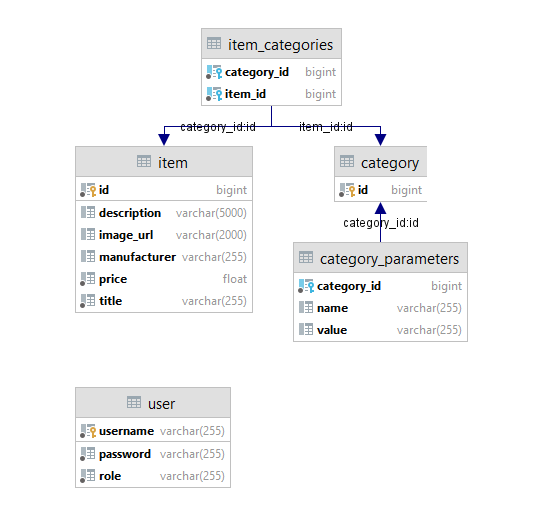

# Model baze podataka

# Opis baze podataka

### User
- **username** - varchar, jedinstveni kljuc, predstavlja korisnicko ime
- **password** - varchar, predstavlja lozinku korisnika
- **role** - varchar, predstavlja ulogu korisnika, dozvoljenje vrednosti su **ADMIN** i **USER**

### Item
- **id** - bigint, jedinstveni kljuc, generisan
- **description** - varchar(5000), predstavlja detaljni opis proizvoda
- **image_url** - varchar(2000), predsvalja putanju do slike proizvoda 
- **manufacturer** - varchar, predstavlja naziv proizvodjaca
- **price** - float, predstavlja cenu proizvoda
- **title** - varchar, predstavlja naziv proizvoda
- **categories** - lista kategorija predstavljenih u tebeli **item_categories** vezom **many_to_many**

### Category
- **id** - bigint, jedistveni kljuc, generisan
- **parameters** - skup parametara predstavljenih u tebeli **category_parameters**
- **items** - lista proizvoda predstavljenih u tebeli **item_categories** vezom **many_to_many**

### Category Parameters
- **category_id** - bigint, jedinstveni kljuc, predstavlja vezu parametra sa kategorijom
- **name** - varchar, naziv parametra
- **value** - varchar, vrednost parametra

### Item Categories
- **category_id** - bigint, jedinstveni kljuc, predstavlja stranu kategorije
- **item_id** - bigint, jedinstveni kljuc, predstavlja stranu proizvoda
