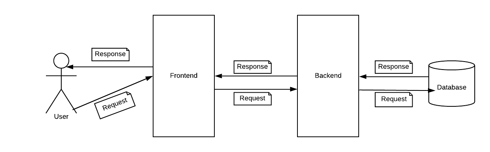

# Model Sistema

# Opis sistema

- Korisnik, interagovanjem sa frontendom, podnosi zahtev za prikaz informacija
- Frontend asinhrono salje zahtev backendu kako bi dobavio zeljene informacije
- Backend obradjuje zahtev, salje upit bazi kako bi dobio zeljene informacije i vraca odgovor frontendu
- Frontend obradjuje odgovor i prikazuje informacije korisniku

Komunikacija frontenda i backenda se odigrava iskljucivo asinhrono, korisniku nije blokiran pristup sadrzaju dok
ce zahtev obradjuje. U trenutku kada stigne odgovor od backenda, frontend je obavesten i stanje aplikacije se osvezava.
